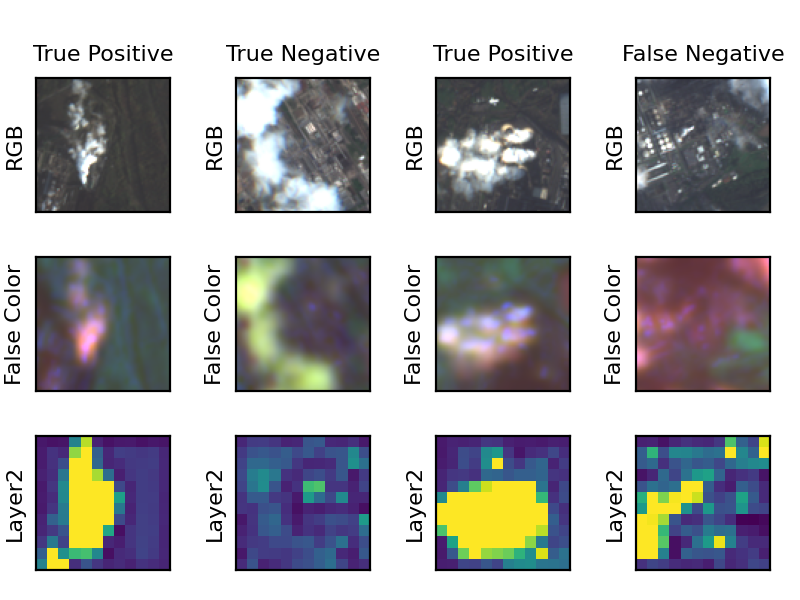

# Smoke-Detection
In this study, we explore the potential of utilizing multiband image data from ESA's Sentinel-2 satellites, which are globally accessible and freely available, to detect and measure industrial smoke plumes. The concerned work is divided into 2 parts, classification and segmentation. Initially, it is performed on RGB images followed by Grayscale images to achieve enhanced performance.

**Dataset:** Available at [zenodo](https://zenodo.org/record/4250706)

### Classification
A customized ResNet-50 model is applied initially on the RGB GeoTIFF images to categorize them based on whether they contain smoke plumes. Our model successfully classified images with an accuracy of 94.4%. To further enhance the accuracy, we convert images to grayscale and achieve an accuracy of 96.4% resulting in a notable increase in the precision of prediction.

  
  <h4 align="center">Classification on RGB Images</h4>

### Segmentation
Similarly, for segmentation, a customized U-Net model is employed initially on the RGB images where the boundaries of smoke are  highlighted. An IoU(Intersection-over-Union) metric is used as a measure to compare the ground truth smoke to the predicted smoke intensity. unlike classification, we obtain similar accuracy of approximately 94% in both RGB and grayscale images.

